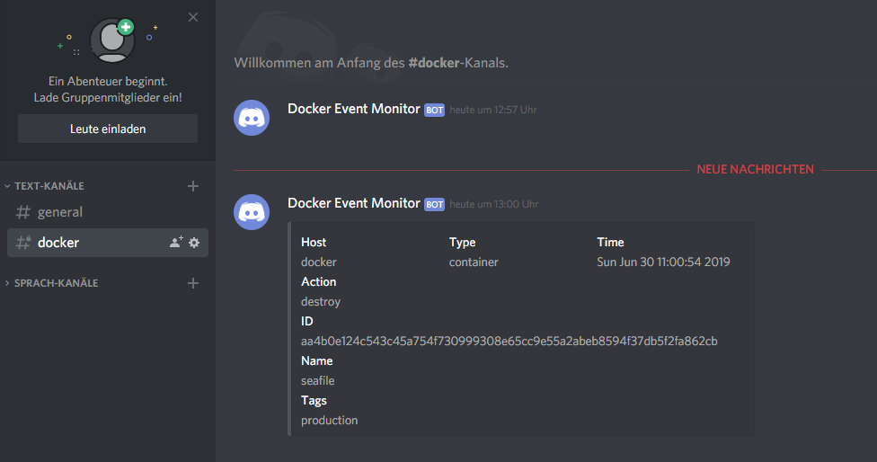

# LB3 <!-- omit in toc -->
### Inhalt <!-- omit in toc -->
- [Ziel](#Ziel)
- [Übersicht](#%C3%9Cbersicht)
- [Installation](#Installation)
  - [Umgebung starten](#Umgebung-starten)
- [Testfälle](#Testf%C3%A4lle)
- [Sicherheitsaspekte](#Sicherheitsaspekte)
- [Service überwachung & aktive Benachrichtigung](#Service-%C3%BCberwachung--aktive-Benachrichtigung)
- [Dokumentation](#Dokumentation)
  - [Containerisierung / Docker](#Containerisierung--Docker)
  - [Microservices](#Microservices)
- [Reflexion](#Reflexion)
  - [Vergleich Vorwissen - Wissenszuwachs](#Vergleich-Vorwissen---Wissenszuwachs)
  - [Was ist mir gelungen?](#Was-ist-mir-gelungen)
  - [Was ist mir nicht gelungen?](#Was-ist-mir-nicht-gelungen)
  - [Zusammenfassend](#Zusammenfassend)

## Ziel
Für diese LB habe ich mir das Ziel gesetzt, Seafile und Wordpress aufzusetzen. Da es bereits diverse Container Images der beiden Services gibt, wäre es eher redundant diese Images selber zu erstellen. Die beiden services benötigen je noch eine Datenbank. Und um die Sicherheitsaspekte zu erfüllen wird zudem ein Reverse Proxy eingesetzt und ein Service Überwachungstool eingesetzt. Für das Management der Container habe ich noch zusätzlich vor, Portainer einzurichten.

Verwendete images:
- [Seafile](https://hub.docker.com/r/seafileltd/seafile-mc)
- [Wordpress](https://hub.docker.com/_/wordpress)
- [MySQL](https://hub.docker.com/_/mysql)
- [Traefik](https://hub.docker.com/_/traefik) (Reverse-proxy)
- [Portainer](https://hub.docker.com/r/portainer/portainer) (Management für Container)
- [Dem](https://hub.docker.com/r/quaide/dem) (Service Überwachungstool)

## Übersicht

Netzplan:
```
+------------------------------------------------------------------------------------------------------------+
|                                                                                                            |
|  Internes Netz: lan                                                                                        |
|  Externes Netz: reverse-proxy                                                                              |
|                                                                                                            |
+---------------------------------------------------------+--------------------------------------------------+
|                                                         |                                                  |
|  Reverse Proxy                                          |  Datenbank x2                                    |
|   Image: traefik:latest                                 |   Image: mysql:5.7                               |
|   Container-name: reverse-proxy                         |   Container_name: wordpress-db                   |
|   Restart: on-failure                                   |   Volumes:                                       |
|   Volumes:                                              |    * db_data:/var/lib/mysql                      |
|    * $PWD/config/reverse-proxy:/etc/traefik             |   Networks:                                      |
|    * /var/run/docker.sock:/var/run/docker.sock          |    * lan                                         |
|   Networks:                                             |   Restart: on-failure                            |
|    * lan                                                |   Umgebungsvars: Root-pw, User, User-pw und DB   |
|    * reverse-proxy                                      |                                                  |
|   Ports: 80, 8080, 443                                  |                                                  |
|                                                         |                                                  |
+------------------------------------------------------------------------------------------------------------+
|                                                         |                                                  |
|  Wordpress                                              |  Seafile                                         |
|   Image: wordpress:latest                               |   Image: seafileltd/seafile-mc:latest            |
|   Container_name: wordpress                             |   Container_name: seafile                        |
|   Networks:                                             |   Volumes:                                       |
|    * reverse_proxy                                      |    * seafile_data:/shared                        |
|    * lan                                                |   Networks:                                      |
|   Restart: on-failure                                   |    * reverse_proxy                               |
|   Umgebungsvars: DB-Host, User, PW und DB Name          |    * lan                                         |
|   Labels für Reverse proxy:                             |   Restart: on-failure                            |
|    * Domain: wordpress.tbz.lan                          |   Labels für Reverse proxy:                      |
|    * Port: 80                                           |    * Domain: seafile.tbz.lan                     |
|    * Netzwerk: reverse_proxy                            |    * Port: 80                                    |
|                                                         |    * Netzwerk: reverse_proxy                     |
|                                                         |                                                  |
+------------------------------------------------------------------------------------------------------------+
|                                                         |                                                  |
|  Portainer                                              |  Event Monitor                                   |
|   Image: portainer/portainer:latest                     |   Image: quaide/dem:latest                       |
|   Container_name: portainer                             |   Volumes:                                       |
|   Volumes:                                              |    - /var/run/docker.sock:/var/run/docker.sock   |
|    * /^ar/run/docker.sock:/var/run/docker.sock          |    - $PWD/config/dem/conf.yml:/app/conf.yml      |
|    * /var/docker/portainer:/data                        |                                                  |
|   Networks:                                             |                                                  |
|    * reverse_proxy                                      |                                                  |
|    * lan                                                |                                                  |
|   Restart: on-failure                                   |                                                  |
|   Labels:                                               |                                                  |
|    * Domain: portainer.tbz.lan                          |                                                  |
|    * Port: 9000                                         |                                                  |
|    * Netzwerk: reverse-proxy                            |                                                  |
|                                                         |                                                  |
+---------------------------------------------------------+--------------------------------------------------+
```
Schichtenmodell:
```
+---------------------------------------------------------------+
| Container Engine: Docker                                      |
+---------------------------------------------------------------+
| Gast OS: Ubuntu 19.04                                         |
+---------------------------------------------------------------+
| Hypervisor: VMware Workstation                                |
+---------------------------------------------------------------+
| Host OS: Windows 10                                           |
+---------------------------------------------------------------+
| Notebook:  Schulnetz 10.x.x.x                                 |
+---------------------------------------------------------------+
```

## Installation

### Umgebung starten
Bevor die Umgebung gestartet werden kann muss noch das Reverse-Proxy Netzwerk manuell erstellt werden. Hierfür kann der folgende Befehl verwendet werden:
```
docker network create reverse_proxy
```
Zusätzlich werden noch folgende in der Hosts Datei `/etc/hosts` Einträge benötigt, da kein DNS-Server im Einsatz ist:
```
127.0.0.1   tbz.lan
127.0.0.1   wordpress.tbz.lan
127.0.0.1   seafile.tbz.lan
127.0.0.1   portainer.tbz.lan
```
Danach kann im `LB3/Docker` Verzeichnis mit docker-compose die Umgebung gestartet werden
```
docker-compose up -d
```
## Testfälle
- HTTP Traffic wird auf HTTPS umgeleitet ✅
  ```
  curl http://seafile.tbz.lan -vk
  ```
  Ergebnis:
  ```
  > GET / HTTP/1.1
  > Host: seafile.tbz.lan
  > User-Agent: curl/7.64.0
  > Accept: */*
  > 
  < HTTP/1.1 302 Found
  < Location: https://seafile.tbz.lan:443/
  < Date: Sun, 30 Jun 2019 12:40:01 GMT
  < Content-Length: 5
  < Content-Type: text/plain; charset=utf-8
  ```
- Verbindung über HTTP funktioniert ✅
  ```
  curl https://wordpress.tbz.lan -vk
  ```
  Ergebnis:
  ```
  > GET / HTTP/2
  > Host: wordpress.tbz.lan
  > User-Agent: curl/7.64.0
  > Accept: */*
  > 
  * Connection state changed (MAX_CONCURRENT_STREAMS == 250)!
  < HTTP/2 302 
  < cache-control: no-cache, must-revalidate, max-age=0
  < content-type: text/html; charset=UTF-8
  < date: Sun, 30 Jun 2019 12:42:36 GMT
  < expires: Wed, 11 Jan 1984 05:00:00 GMT
  < location: https://wordpress.tbz.lan/wp-admin/install.php
  < server: Apache/2.4.25 (Debian)
  < x-powered-by: PHP/7.3.6
  < x-redirect-by: WordPress
  < content-length: 0
  ```
- Es sind nur die Ports 80, 8080 und 443 geöffnet ✅
  ```
  nmap localhost
  ```
  ```
  Starting Nmap 7.70 ( https://nmap.org ) at 2019-06-30 14:44 CEST
  Nmap scan report for localhost (127.0.0.1)
  Host is up (0.000052s latency).
  Not shown: 996 closed ports
  PORT     STATE SERVICE
  80/tcp   open  http
  443/tcp  open  https
  8080/tcp open  http-proxy
  ```
## Sicherheitsaspekte
- Reverse Proxy  
  Es wurde ein Reverse Proxy (Traefik) für die Umgebung verwendet. Dieser hat den grossen Vorteil, dass man relativ einfach neue Container hinzugefügen kann. Die Konfiguration des Reverse-proxy ist in zwei Teile aufgeteilt, es gibt die `traefik.toml` Datei und in der Container Definition noch einen Abschnitt `labels:` der festgelegt werden muss.  

  Beispiel Inhalt der `traefik.toml` Datei:
  ```
  [docker]
  domain = "tbz.lan"
  watch = true
  exposedbydefault = false
  endpoint = "unix:///var/run/docker.sock"

  [entryPoints]
    [entryPoints.http]
    address = ":80"
      [entryPoints.http.redirect]
      entryPoint = "https"
  [entryPoints.https]
  address = ":443"
    [entryPoints.https.tls]
  ```

  Beispiel eines `labels:` innerhalb einer Container Definition:
  ```
  labels:
      - "traefik.backend=seafile"
      - "traefik.enable=true"
      - "traefik.frontend.rule=Host:seafile.tbz.lan"
      - "traefik.port=80"
      - "traefik.docker.network=reverse_proxy"
  ```
- Nestarts begrenzen
  Um bei einem DOS Angriff die Systeme nicht zu überlasten habe ich bei `restart:` anstatt `always` den Wert `on-failure` eingesetzt. Dies bewirkt, dass Docker im Falle eines Angriffes die Container nicht die ganze Zeit wieder versucht zu startet, sondern nur wenn ein Fehler auftritt.

- Netzwerkzugriff beschränken  
  Im Docker-compose file sind bis auf die vom Reverse Proxy benötigten Ports keine weiteren Ports freigegeben. Die Kommunikation von aussen zu den Container geht somit ausschliesslich über den Reverse Proxy.

## Service überwachung & aktive Benachrichtigung
Mit der Hilfe des Containers "Docker Event Monitor" kurz dem, können die erstellen Services nach Änderungen überprüft werden. Sollte nun eine Änderung durchgeführt werden, wie z. B. das zerstören eines Containers, dann kann eingerichtet werden, dass eine Nachricht an Slack, Sparkpost oder wie in meinem Beispiel Discord versendet wird. In einer config.yml Datei wird konfiguriert, welche Events gemeldet sollen. In dem Bild unten sieht man wie eine solche Nachricht aussieht.



Beispiel einer Konfiguration:
```
settings:
  logging: info 
  tags:
    - production

  exclusions:
  inclusions: 
    - portainer
    - seafile
    - seafile_db
    - wordpress
    - wordpress_db
    - traefik
    - reverse_proxy

events: ## The Docker event types that you want to trigger alerts for
  container: 
    - 'health_status: unhealthy'
    - oom
    - destroy
    - create
  image: 
    - delete

integrations: ## Available integrations  
  discord:
    enabled: True
    url: https://discordapp.com/api/webhooks/<webhook-id>
```

## Dokumentation

### Containerisierung / Docker
Heutzutage ist die Containerisierung ein wichtiges Thema. Immer mehr und mehr Firmen setzten auf die Containervirtualisierung. Umso wichtiger ist es, dieses Thema gut zu verstehen. Die Container an sich, teilen sich mit dem host den Kernel und verwenden unter Linux ensprechende Kernelmodule um die Container von dem Host zu isolieren. Trotzdem bietet die Containervirtualisierung keine vergleichbar hohe Isolierung wie bei Virtuellen Maschinen. Vorteile sind auf jeden Fall, die kurzen Aufstartzeiten, geringerer CPU-Overhead, Portierbar, mehrere Instanzen des gleichen Images können gleichzeitig laufen.

Hier erkläre ich ein paar der Docker Befehle:

| Befehl | Erklärung |
| --- | --- |
| `docker run` | Mit diesem Befehl kann ein Container gestartet werden. Typische parameter sind z. B. `-p`,`--name`, `--rm`. Genäuere Informationen können auch aus dem Manual entnommen werden -> `man docker run`| 
| `docker exec` | Mithilfe dieses Befehls kann auf ein Container zugegriffen werden. Sozusagen das SSH um auf die Container zu gelangen. Bei dem Zugriff muss zwingen ein Commandline Interpreter mitgegeben werden. Z. B. `docker exec -it seafile bash`. |
| `docker ps` | Dieser Befehl listet alle laufende Container auf. Es können zusätzlich Informationen entnommen werden wie z. B. welche Ports freigegeben wurden und welches Image verwendet wurde. |
| `docker stop` | Mit diesem Befehl können Container gestoppt werden. Hierfür muss entweder die Container ID verwendet werden oder den Namen. |
| `docker-compose up` | Mit diesem Befehl kann eine Docker-compose Umgebung gestartet werden. |
| `docker-compose down` | Dieser Befehl stoppt eine Docker-compose Umgebung und entfernt anschliessend noch alle Container. |

### Microservices

## Reflexion
### Vergleich Vorwissen - Wissenszuwachs

### Was ist mir gelungen?

### Was ist mir nicht gelungen?

### Zusammenfassend