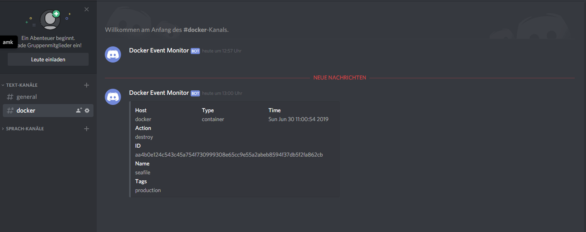

# LB3 <!-- omit in toc -->
### Inhalt <!-- omit in toc -->
- [Ziel](#Ziel)
- [Übersicht](#%C3%9Cbersicht)
- [Installation](#Installation)
  - [Umgebung starten](#Umgebung-starten)
- [Testfälle](#Testf%C3%A4lle)
- [Sicherheitsaspekte](#Sicherheitsaspekte)
- [Service überwachung](#Service-%C3%BCberwachung)
- [Dokumentation](#Dokumentation)
  - [Containerisierung / Docker](#Containerisierung--Docker)
  - [Microservices](#Microservices)
- [Reflexion](#Reflexion)
  - [Vergleich Vorwissen - Wissenszuwachs](#Vergleich-Vorwissen---Wissenszuwachs)
  - [Was ist mir gelungen?](#Was-ist-mir-gelungen)
  - [Was ist mir nicht gelungen?](#Was-ist-mir-nicht-gelungen)
  - [Zusammenfassend](#Zusammenfassend)

## Ziel
Für diese LB habe ich mir das Ziel gesetzt, Seafile und Wordpress aufzusetzen. Da es bereits diverse Container Images der beiden Services gibt, wäre es eher redundant diese Images selber zu erstellen. Die beiden services benötigen je noch eine Datenbank. Und um die Sicherheitsaspekte zu erfüllen wird zudem ein Reverse Proxy eingesetzt und ein Service Überwachungstool eingesetzt. Für das Management der Container habe ich noch zusätzlich vor, Portainer einzurichten.

Verwendete images:
- [Seafile](https://hub.docker.com/r/seafileltd/seafile-mc)
- [Wordpress](https://hub.docker.com/_/wordpress)
- [MySQL](https://hub.docker.com/_/mysql)
- [Traefik](https://hub.docker.com/_/traefik) (Reverse-proxy)
- [Portainer](https://hub.docker.com/r/portainer/portainer) (Management für Container)
- [Dem](https://hub.docker.com/r/quaide/dem) (Service Überwachungstool)


Host einträge benötigt:

127.0.0.1	tbz.lan
127.0.0.1	wordpress.tbz.lan
127.0.0.1	seafile.tbz.lan
127.0.0.1   portainer.tbz.lan


## Übersicht

## Installation

### Umgebung starten
Bevor die Umgebung gestartet werden kann muss noch das Reverse-Proxy Netzwerk manuell erstellt werden. Hierfür kann der folgende Befehl verwendet werden
```
docker network create reverse_proxy
```
Zusätzlich werden noch folgende in der Hosts Datei `/etc/hosts` Einträge benötigt, da kein DNS-Server im Einsatz ist:
```
127.0.0.1   tbz.lan
127.0.0.1   wordpress.tbz.lan
127.0.0.1   seafile.tbz.lan
127.0.0.1   portainer.tbz.lan
```
Danach kann im `LB3/Docker` Verzeichnis mit docker-compose die Umgebung gestartet werden
```
docker-compose up -d
```
## Testfälle

## Sicherheitsaspekte
- Reverse Proxy  
  Es wurde ein Reverse Proxy (Traefik) für die Umgebung verwendet. Dieser hat den grossen Vorteil, dass man relativ einfach neue Container hinzugefügen kann. Die Konfiguration des Reverse-proxy ist in zwei Teile aufgeteilt, es gibt die `traefik.toml` Datei und in der Container Definition noch einen Abschnitt `labels:` der festgelegt werden muss.  

  Beispiel Inhalt der `traefik.toml` Datei:
  ```
  [docker]
  domain = "tbz.lan"
  watch = true
  exposedbydefault = false
  endpoint = "unix:///var/run/docker.sock"

  [entryPoints]
    [entryPoints.http]
    address = ":80"
      [entryPoints.http.redirect]
      entryPoint = "https"
  [entryPoints.https]
  address = ":443"
    [entryPoints.https.tls]
  ```

  Beispiel eines `labels:` innerhalb einer Container Definition:
  ```
  labels:
      - "traefik.backend=seafile"
      - "traefik.enable=true"
      - "traefik.frontend.rule=Host:seafile.tbz.lan"
      - "traefik.port=80"
      - "traefik.docker.network=reverse_proxy"
  ```
- Nestarts begrenzen
  Um bei einem DOS Angriff die Systeme nicht zu überlasten habe ich bei `restart:` anstatt `always` den Wert `on-failure` eingesetzt. Dies bewirkt, dass Docker im Falle eines Angriffes die Container nicht die ganze Zeit wieder versucht zu startet, sondern nur wenn ein Fehler auftritt.

- Netzwerkzugriff beschränken  
  Im Docker-compose file sind bis auf die vom Reverse Proxy benötigten Ports keine weiteren Ports freigegeben. Die Kommunikation von aussen zu den Container geht somit ausschliesslich über den Reverse Proxy.
## Service überwachung
Mit der Hilfe des Containers "Docker Event Monitor" kurz dem, können die erstellen Services nach Änderungen überprüft werden. Sollte nun eine Änderung durchgeführt werden, wie z. B. das zerstören eines Containers, dann kann eingerichtet werden, dass eine Nachricht an Slack, Sparkpost oder wie in meinem Beispiel Discord versendet wird. In einer config.yml Datei wird konfiguriert, welche Events gemeldet sollen. In dem Bild unten sieht man wie eine solche Nachricht aussieht.



Beispiel einer Konfiguration:
```
settings:
  logging: info 
  tags:
    - production

  exclusions:
  inclusions: 
    - portainer
    - seafile
    - seafile_db
    - wordpress
    - wordpress_db
    - traefik
    - reverse_proxy

events: ## The Docker event types that you want to trigger alerts for
  container: 
    - 'health_status: unhealthy'
    - oom
    - destroy
    - create
  image: 
    - delete

integrations: ## Available integrations  
  discord:
    enabled: True
    url: https://discordapp.com/api/webhooks/<webhook-id>
```

## Dokumentation

### Containerisierung / Docker
Wissenstand und definition + Befehle

### Microservices

## Reflexion
### Vergleich Vorwissen - Wissenszuwachs

### Was ist mir gelungen?

### Was ist mir nicht gelungen?

### Zusammenfassend